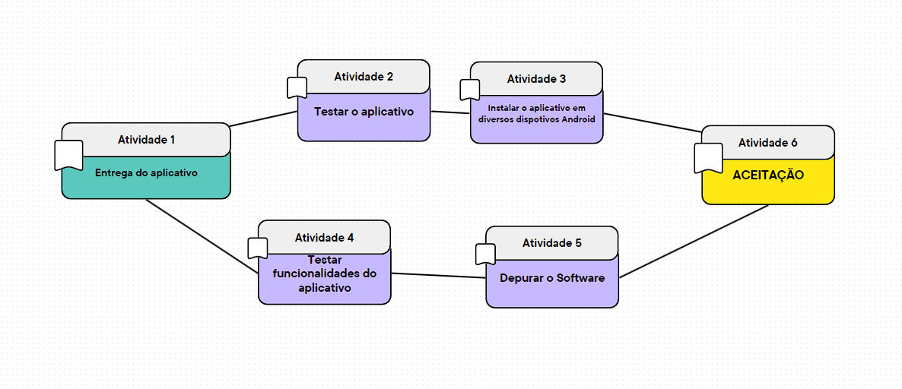
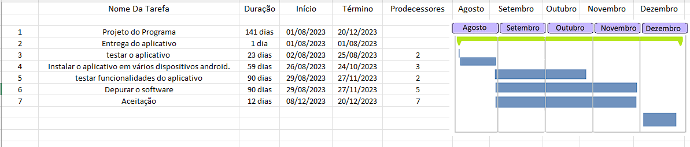
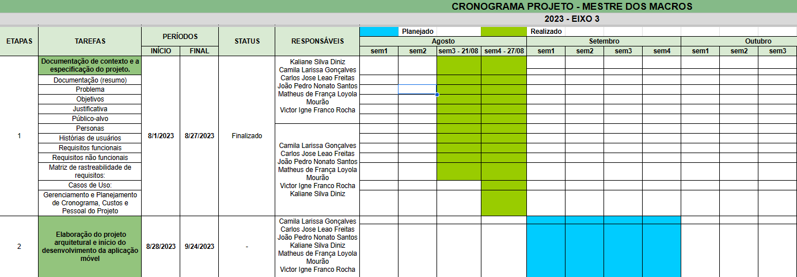
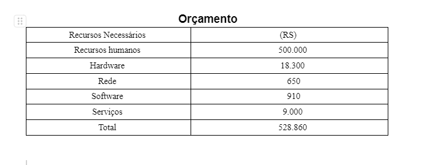

# Especificações do Projeto

Pré-requisitos: <a href="1-Documentação de Contexto.md"> Documentação de Contexto</a>

Definição do problema e ideia de solução a partir da perspectiva do usuário. É composta pela definição do  diagrama de personas, histórias de usuários, requisitos funcionais e não funcionais além das restrições do projeto.

Apresente uma visão geral do que será abordado nesta parte do documento, enumerando as técnicas e/ou ferramentas utilizadas para realizar a especificações do projeto

## Personas

Camila Larissa, Suporte de E - Commerce  :  
Idade: 25 anos  
Área: suporte ao cliente   
Localização: Juiz de Fora - Minas Gerais   
Motivação: .Cuidar da saúde, ter mais disposição, melhorar a alimentação   
Necessidades: Saber os benefícios dos alimentos, ter o controle de consumo de água, lembrete dos horários das refeições    
Comportamento: Passa muito tempo pesquisando os benefícios dos alimentos, não sabe quanto é seu consumo de água diária  

Johnny Silvestre, Analista de sistemas:  
Idade: 30 anos  
Área: TI  
Localização: Belo Horizonte - Minas Gerais   
Motivação: saúde, auto-estima, desenvolver um físico estético  
Necessidades: Saber exatamente a quanto de proteína, carboidrato e calorias ingeridas nas refeições durante o dia  
Comportamento: Passa muito tempo na academia, extremamente preocupado com a  sua dieta e com o andamento do seu progresso 

Victor Igne, Desenvolvedor de VE  :  
Idade: 21 anos  
Área: Desenvolvedor de Software   
Localização: Rio de Janeiro - Rio de Janeiro   
Motivação: . Evoluir o físico, melhorar a saúde e qualidade de vida.  
Necessidades: ajustar e analisar o consumo de alimentos diários.     
Comportamento: Busca conhecimento sobre treino mas não sabe ajustar dieta 

Matheus Mourão / Economista :  
Idade: 40 anos  
Área: autônomo  
Localização: Vitória - Espírito Santo   
Motivação: ganho de massa magra, melhorar condicionamento físico  
Necessidades: Atingir metas diárias de consumo proteico/calórico  
Comportamento: Indisciplinado com a dieta 

Maria Augusta / Contadora :  
Idade: 36 anos  
Área: Gestão financeira  
Localização: São Paulo - São Paulo   
Motivação: diminuir o percentual de gordura corporal  
Necessidades: Atingir metas diárias de consumo calórico  
Comportamento: Indisciplinado em seguir a dieta 

 
Ana Cláudia / Aposentada :
Idade: 67 anos
Área: Aposentada
Localização: Petrópolis - Rio de Janeiro 
Motivação: ser fisicamente mais ativa, perder peso
Necessidades: Atingir metas diárias de consumo calórico
Comportamento: Dificuldade em lidar com aplicativos de dietas pela complexidade e em calcular as calorias diárias consumidas.

## Histórias de Usuários

Com base na análise das personas forma identificadas as seguintes histórias de usuários:

|EU COMO... `PERSONA`| QUERO/PRECISO ... `FUNCIONALIDADE` |PARA ... `MOTIVO/VALOR`                 |
|--------------------|------------------------------------|----------------------------------------|
|Camila Larissa  | Desejo calcular a minha quantidade de macros da minha dieta  | Para controlar a quantidade de ingestão de proteína, carboidratos e gorduras. |
|Johnny Silvestre    | Quero ter de forma sistemática a minha progressão através de gráficos                 | Para assim desenvolver minha dieta com base na minha evolução dentro dos meus calculos  |
|Victor Igne      | Deseja estruturar refeições feitas através de informações nutricionais de um banco de dados                 | Para, dessa forma, criar novas refeições a partir das variações dos alimentos pré selecionados |
|Maria Augusta       | Gostaria de ser notificado das minhas refeições e hidratação, além de ser orientado / reconhecido pelo andamento da dieta                | para que assim eu consiga manter uma rotina motivada e organizada. |
|Ana Cláudia       | Gostaria de ser notificado para adicionar minhas refeições e verificar o consumo de gorduras.                | Para ter um controle melhor dos horários e consumos de alimentos que fazem mal à saúde. |
|Matheus Mourão      | Gostaria de cadastrar minhas métricas de cálculo para definir a minha quantidade de consumo.               | E assim, ter o controle sobre a minha evolução e comparar meus resultados conforme as minhas informações. |

> **Links Úteis**:
> - [Histórias de usuários com exemplos e template](https://www.atlassian.com/br/agile/project-management/user-stories)
> - [Como escrever boas histórias de usuário (User Stories)](https://medium.com/vertice/como-escrever-boas-users-stories-hist%C3%B3rias-de-usu%C3%A1rios-b29c75043fac)
> - [User Stories: requisitos que humanos entendem](https://www.luiztools.com.br/post/user-stories-descricao-de-requisitos-que-humanos-entendem/)
> - [Histórias de Usuários: mais exemplos](https://www.reqview.com/doc/user-stories-example.html)
> - [9 Common User Story Mistakes](https://airfocus.com/blog/user-story-mistakes/)

## Modelagem do Processo de Negócio 

### Análise da Situação Atual

Apresente aqui os problemas existentes que viabilizam sua proposta. Apresente o modelo do sistema como ele funciona hoje. Caso sua proposta seja inovadora e não existam processos claramente definidos, apresente como as tarefas que o seu sistema pretende implementar são executadas atualmente, mesmo que não se utilize tecnologia computacional. 

### Descrição Geral da Proposta

Apresente aqui uma descrição da sua proposta abordando seus limites e suas ligações com as estratégias e objetivos do negócio. Apresente aqui as oportunidades de melhorias.

### Processo 1 – NOME DO PROCESSO

Apresente aqui o nome e as oportunidades de melhorias para o processo 1. Em seguida, apresente o modelo do processo 1, descrito no padrão BPMN. 

### Processo 2 – NOME DO PROCESSO

Apresente aqui o nome e as oportunidades de melhorias para o processo 2. Em seguida, apresente o modelo do processo 2, descrito no padrão BPMN.

## Indicadores de Desempenho

Apresente aqui os principais indicadores de desempenho e algumas metas para o processo. Atenção: as informações necessárias para gerar os indicadores devem estar contempladas no diagrama de classe. Colocar no mínimo 5 indicadores. 

Usar o seguinte modelo: 

Obs.: todas as informações para gerar os indicadores devem estar no diagrama de classe a ser apresentado a posteriori. 

## Requisitos

As tabelas que se seguem apresentam os requisitos funcionais e não funcionais que detalham o escopo do projeto. Para determinar a prioridade de requisitos, aplicar uma técnica de priorização de requisitos e detalhar como a técnica foi aplicada.

### Requisitos Funcionais

|ID    | Descrição do Requisito  | Prioridade |
|------|-----------------------------------------|----|
|RF-001| Os usuários devem ser capazes de pesquisar e selecionar alimentos a partir de um banco de dados abrangente, que inclui informações nutricionais detalhadas para cada item. | ALTA | 
|RF-002| O aplicativo deve calcular automaticamente as quantidades de carboidratos, proteínas e gorduras com base nas porções dos alimentos registrados pelos usuários.  | ALTA |
|RF-003| Ao realizar o login o usuário deve poder definir e editar suas próprias metas diárias de ingestão de macros, levando em consideração fatores como objetivos de condicionamento físico, idade, peso, altura e nível de atividade.  | ALTA |
|RF-004| Uma funcionalidade de lembretes e notificações pode ser implementada para lembrar os usuários de registrar suas refeições e monitorar seu consumo de macros.  | MÉDIA |
|RF-005| O aplicativo deve permitir que os usuários registrem suas refeições personalizadas.   | ALTA |
|RF-006| O aplicativo deve conter um sistema de gráfico com os resultados do andamento de sua alimentação.  | ALTA |
|RF-007| Além do cálculo de macros, o aplicativo deve permitir que os usuários registrem a quantidade de água que estão consumindo ao longo do dia para manter um bom nível de hidratação.   | MÉDIA  |
|RF-008|  O aplicativo deve alertar os usuários quando eles estiverem se aproximando de exceder ou ficar aquém de suas metas diárias de macros, notificando para realizar ajustes.  | ALTA |
|RF-009| Apresentar as variações de preparo de um mesmo alimento para ajudar os usuários a fazer escolhas mais conscientes.  | BAIXA |
|RF-010| O aplicativo deve conter frases motivacionais para incentivar o usuário.  | BAIXA |

### Requisitos não Funcionais

|ID     | Descrição do Requisito  |Prioridade |
|-------|-------------------------|----|
|RNF-001| A interface do aplicativo deve ser fácil de usar, com layouts claros e navegação lógica. | ALTA | 
|RNF-002| O aplicativo deve ser acessível para pessoas com deficiências visuais, motoras ou auditivas |  ALTA | 
|RNF-003| O aplicativo deve ser compatível com o sistema operacional Android. |  ALTA | 
|RNF-004| O sistema utilizará uma API Externa para auxílio no banco de dados |  ALTA | 
|RNF-005| Será utilizada  as seguintes tecnologias: React-native, Java-script, Python, Flask, PostgresSQL.  |  ALTA | 
|RNF-006| Deploy Frontend: Vercel |  MÉDIA| 

Com base nas Histórias de Usuário, enumere os requisitos da sua solução. Classifique esses requisitos em dois grupos:

- [Requisitos Funcionais
 (RF)](https://pt.wikipedia.org/wiki/Requisito_funcional):
 correspondem a uma funcionalidade que deve estar presente na
  plataforma (ex: cadastro de usuário).
- [Requisitos Não Funcionais
  (RNF)](https://pt.wikipedia.org/wiki/Requisito_n%C3%A3o_funcional):
  correspondem a uma característica técnica, seja de usabilidade,
  desempenho, confiabilidade, segurança ou outro (ex: suporte a
  dispositivos iOS e Android).
Lembre-se que cada requisito deve corresponder à uma e somente uma
característica alvo da sua solução. Além disso, certifique-se de que
todos os aspectos capturados nas Histórias de Usuário foram cobertos.

## Restrições

O projeto está restrito pelos itens apresentados na tabela a seguir.

|ID| Restrição                                             |
|--|-------------------------------------------------------|
|01| Não roda em IOS |
|02| Aplicativo em português        |
|03| O projeto deverá ser entregue até o final do semestre |

Enumere as restrições à sua solução. Lembre-se de que as restrições geralmente limitam a solução candidata.

> **Links Úteis**:
> - [O que são Requisitos Funcionais e Requisitos Não Funcionais?](https://codificar.com.br/requisitos-funcionais-nao-funcionais/)
> - [O que são requisitos funcionais e requisitos não funcionais?](https://analisederequisitos.com.br/requisitos-funcionais-e-requisitos-nao-funcionais-o-que-sao/)

## Diagrama de Casos de Uso

O diagrama de casos de uso é o próximo passo após a elicitação de requisitos, que utiliza um modelo gráfico e uma tabela com as descrições sucintas dos casos de uso e dos atores. Ele contempla a fronteira do sistema e o detalhamento dos requisitos funcionais com a indicação dos atores, casos de uso e seus relacionamentos. 

As referências abaixo irão auxiliá-lo na geração do artefato “Diagrama de Casos de Uso”.

> **Links Úteis**:
> - [Criando Casos de Uso](https://www.ibm.com/docs/pt-br/elm/6.0?topic=requirements-creating-use-cases)
> - [Como Criar Diagrama de Caso de Uso: Tutorial Passo a Passo](https://gitmind.com/pt/fazer-diagrama-de-caso-uso.html/)
> - [Lucidchart](https://www.lucidchart.com/)
> - [Astah](https://astah.net/)
> - [Diagrams](https://app.diagrams.net/)

# Matriz de Rastreabilidade

A matriz de rastreabilidade é uma ferramenta usada para facilitar a visualização dos relacionamento entre requisitos e outros artefatos ou objetos, permitindo a rastreabilidade entre os requisitos e os objetivos de negócio. 

A matriz deve contemplar todos os elementos relevantes que fazem parte do sistema, conforme a figura meramente ilustrativa apresentada a seguir.

> **Links Úteis**:
> - [Artigo Engenharia de Software 13 - Rastreabilidade](https://www.devmedia.com.br/artigo-engenharia-de-software-13-rastreabilidade/12822/)
> - [Verificação da rastreabilidade de requisitos usando a integração do IBM Rational RequisitePro e do IBM ClearQuest Test Manager](https://developer.ibm.com/br/tutorials/requirementstraceabilityverificationusingrrpandcctm/)
> - [IBM Engineering Lifecycle Optimization – Publishing](https://www.ibm.com/br-pt/products/engineering-lifecycle-optimization/publishing/)

# Gerenciamento de Projeto

De acordo com o PMBoK v6 as dez áreas que constituem os pilares para gerenciar projetos, e que caracterizam a multidisciplinaridade envolvida, são: Integração, Escopo, Cronograma (Tempo), Custos, Qualidade, Recursos, Comunicações, Riscos, Aquisições, Partes Interessadas. Para desenvolver projetos um profissional deve se preocupar em gerenciar todas essas dez áreas. Elas se complementam e se relacionam, de tal forma que não se deve apenas examinar uma área de forma estanque. É preciso considerar, por exemplo, que as áreas de Escopo, Cronograma e Custos estão muito relacionadas. Assim, se eu amplio o escopo de um projeto eu posso afetar seu cronograma e seus custos.

## Gerenciamento de Tempo

Com diagramas bem organizados que permitem gerenciar o tempo nos projetos, o gerente de projetos agenda e coordena tarefas dentro de um projeto para estimar o tempo necessário de conclusão.

O gráfico de Gantt ou diagrama de Gantt também é uma ferramenta visual utilizada para controlar e gerenciar o cronograma de atividades de um projeto. Com ele, é possível listar tudo que precisa ser feito para colocar o projeto em prática, dividir em atividades e estimar o tempo necessário para executá-las.

## Gerenciamento de Equipe

O gerenciamento adequado de tarefas contribuirá para que o projeto alcance altos níveis de produtividade. Por isso, é fundamental que ocorra a gestão de tarefas e de pessoas, de modo que os times envolvidos no projeto possam ser facilmente gerenciados. 

## Gestão de Orçamento

O processo de determinar o orçamento do projeto é uma tarefa que depende, além dos produtos (saídas) dos processos anteriores do gerenciamento de custos, também de produtos oferecidos por outros processos de gerenciamento, como o escopo e o tempo.

