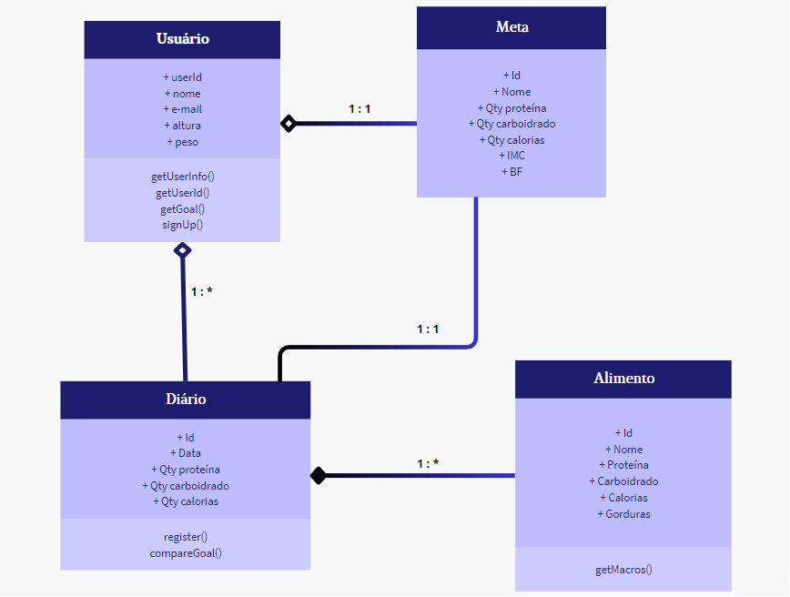
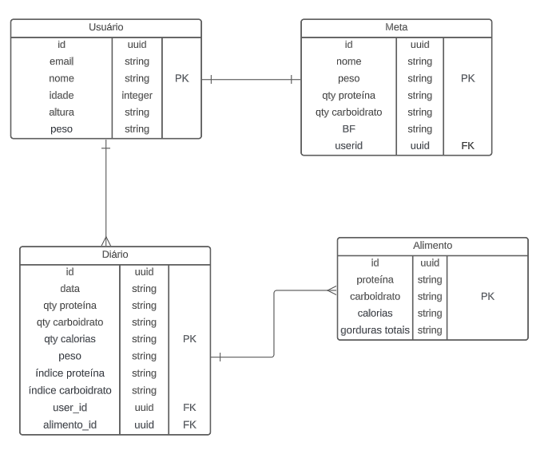

# Arquitetura da Solução

Pré-requisitos: <a href="3-Projeto de Interface.md"> Projeto de Interface</a>

Definição de como o software é estruturado em termos dos componentes que fazem parte da solução e do ambiente de hospedagem da aplicação.

## Diagrama de Classes

## Modelo ER

## Esquema Relacional

> - [Criando um modelo relacional - Documentação da IBM](https://www.ibm.com/docs/pt-br/cognos-analytics/10.2.2?topic=designer-creating-relational-model)

## Modelo Físico

docs\bd\Script-tabelas-database.sql

## Tecnologias Utilizadas

As tecnologias utilizadas neste projeto serão: 

    Linguagens: JavaScript, Python.
    Frameworks: React Native, Flask.
    SGBD: MySQL.
    Ferramentas: Visual Studio Code, Android Studio.
    Bibliotecas: Flask-SQLAlchemy, python-dotenv, Flask-Migrate.

## Hospedagem

Neste projeto será utilizado como Hospedagem a plataforma Heroku.

## Qualidade de Software

O glossário do IEEE (Instituto de Engenheiros Eletrônicos e Eletricistas) define qualidade de software como “grau de conformidade de um sistema, componente ou processo com os respectivos requisitos, as necessidades e expectativas de clientes ou usuários.

A qualidade de software do projeto Mestre dos Macros segue os fundamentos descriminados na norma técnica ISO/IEC 25010 para a avaliação.

Adequação funcional:

O público-alvo do projeto é composto por pessoas que buscam uma forma de gerenciamento alimentício, de acordo com a sua finalidade. Esse público pode incluir pessoas que buscam cuidar da saúde, elevar a qualidade de vida, aprimorar a dieta, fins estéticos, manutenção da massa ou gordura corporal. As funções da nossa aplicação foram pensadas para realizar as tarefas e atender os objetivos específicos do nosso público-alvo. Apresentamos aos usuários etapas necessárias para auxiliar o gerenciamento nutricional de acordo com as necessidades do usuário.

Eficiência de desempenho:

Nenhum usuário gosta de um software lento. Normalmente ficam impacientes e dependendo da situação até desinstalam ou deixam de lado. Esse princípio reflete justamente esse aspecto. Nosso software possui resposta em tempo hábil, sem deixar o usuário esperando.

Compatibilidade:

O grupo preza pela capacidade de executar o software independente do dispositivo móvel. Essa caractéristica é muito importante, pois, permite alçancar um número maior de pessoas. Nossa aplicação é compatível com Android e IOS.

Usabilidade:

Durante as reuniões em grupo foi discutido a praticidade do uso do aplicativo e chegou-se à conclusão de que um design simples, porém funcional, e assim foi desenvolvido.

Confiabilidade:

A aplicação será testada por nossos desenvolvedores durante todo o processo para identificar falhas durante sua execução, frequência de defeitos apresentados, disponibilidade para os usuários ou se ocorre algum comportamento inesperado durante seu funcionamento após alguma modificação.

Segurança:

A segurança é um dos pontos mais importantes. Afinal, ninguém quer utilizar algo inseguro, portanto nós desenvolvedores dessa aplicação somos responsáveis por quaisquer informações inseridas pelos usuários no sistema. Nossa aplicação não permite o vazamento de dados dos usuários cadastrados.

Capacidade de manutenção:

A reusabilidade da aplicação significará reduzir custos e tempo no processo de desenvolvimento e manutenção, aumentar a qualidade, entre outras diversas vantagens. Como nossa aplicação será desenvolvida em React Native, será possível reutilizar componentes para se obter agilidade no desenvolvimento e manutenção.

Portabilidade:

A portabilidade é fundamental em nossa aplicação e será definida através da capacidade da aplicação ser facilmente transportável, ou seja, se é capaz de executar todas as suas funções em diferentes sistemas operacionais. Nossa aplicação pode ser utilizada por tipos de pessoas diferentes em diversos ambientes e dispostivos móveis.

Conceituar qualidade de fato é uma tarefa complexa, mas ela pode ser vista como um método gerencial que através de procedimentos disseminados por toda a organização, busca garantir um produto final que satisfaça às expectativas dos stakeholders.

No contexto de desenvolvimento de software, qualidade pode ser entendida como um conjunto de características a serem satisfeitas, de modo que o produto de software atenda às necessidades de seus usuários. Entretanto, tal nível de satisfação nem sempre é alcançado de forma espontânea, devendo ser continuamente construído. Assim, a qualidade do produto depende fortemente do seu respectivo processo de desenvolvimento.

A norma internacional ISO/IEC 25010, que é uma atualização da ISO/IEC 9126, define oito características e 30 subcaracterísticas de qualidade para produtos de software.
Com base nessas características e nas respectivas sub-características, identifique as sub-características que sua equipe utilizará como base para nortear o desenvolvimento do projeto de software considerando-se alguns aspectos simples de qualidade. Justifique as subcaracterísticas escolhidas pelo time e elenque as métricas que permitirão a equipe avaliar os objetos de interesse.

> **Links Úteis**:
>
> - [ISO/IEC 25010:2011 - Systems and software engineering — Systems and software Quality Requirements and Evaluation (SQuaRE) — System and software quality models](https://www.iso.org/standard/35733.html/)
> - [Análise sobre a ISO 9126 – NBR 13596](https://www.tiespecialistas.com.br/analise-sobre-iso-9126-nbr-13596/)
> - [Qualidade de Software - Engenharia de Software 29](https://www.devmedia.com.br/qualidade-de-software-engenharia-de-software-29/18209/)
